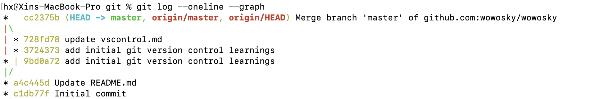

# Version Control of Git
This doc is my learnings based on the course ["Version Control of Git"](https://www.coursera.org/learn/version-control-with-git/home/) on Coursera.

## Set up connection with the remote git repositories
Usually set up ssh connection with the remote git repositories.

1. Generate a new ssh key on your local machine.
    
    `$ ssh-keygen -t ed25519 -C "your_email@example.com"`   

2. Add the new ssh key to your gitHub account
3. Testing your ssh connection

Refer to [Connecting to github with ssh](https://www.coursera.org/learn/version-control-with-git/home/) on GitHub Docs.

## Clone a repository
1. Get the ssh project link from the GitHub.

  

2. Run "git clone" on the local machine

    `$ git clone git@github.com:wowosky/projecta.git` 

    The password of your ssh key will be asked during the cmd run.

3. A project directory same as the remote repository will be created in your local machine.

##  Git Branch
1. Show all branches including remote branches
    
    `$ git branch -a`

2. Create a branch in local
        
    `$ git branch vscontrol`

3. Push the local branch to remote if you would like to use the remote repository to store your branch works.
        
    `$ git push -u origin vscontrol`

    Then you can use "git branch -a" to check that a remote branch was created and linked to the local branch.
    
4. To sync remote branches to local
    
    If a remote branch was deleted, you have to sync it with local.

    '$ git remote update --prune'

    
5. Delete a branch (e.g. feature1) 
        
    `$ git branch -d feature1 `   -- delete feature1 in local
        
    `$ git push origin -d feature1`   -- delete feature1 in remote

## Git Merge
1. Merge a branch (e.g. feature1) directly to master branch

    Sitting in master branch, and run
        
    `$git merge feature1 --no-ff`  -- no-ff means to create a commit, it will make the history more elegant.

## Tag a branch

If you would like to add a tag to git branch, for example add a release tag to master, you can use git tag commands.

`$ git tag -a v1.00`

## Rewrite git histories

To view the git commit histories in a clean graph view

`$ git log --oneline --graph`

### Scenario 1 - squash multiple commits into one commit

The scenairo is classical when you work on a feature or private branch, after several days and serval commits, you need to commit back to master branch. It is to better to squash your commits to simplify the change history, it will also help others to understand your works in a whole, rather than lots of pieces of works. 

1. '$ git log --oneline --graph'

2. '$ git rebase -i 9bd0'

    Rebase from the grandparent at least.
    
    
        Then in the file editor, add "squash" to the commits you would like to squash. Keep "pick" to the commit you would like to keep. 
        
    

    Then you will be asked to update the squash commit message.

3.  View Git logs

    `$ git log --oneline --graph`
        
    

4. Push the squash commit to remote
        
    

### Scenario 2 - rebase one branch on another branch
Usually you are working on a feature branch, and keep the master branch as a central stable branch. When others commit to the master branch, you feature branch is out of sync with master. You have to rebase your feature branch on the master branch to keep sync. 
    
Sitting in feature branch, and run 

`$ git rebase master`  -- usually you have to resolve merge conflicts as the git directions.

Usually after rebase, you local feature branch will be out of sync with its remote. You can run 
    
`$ git push --force` -- to push local changes to overwrite remote.

    Before rebase
    `
    A--B--C------F--G  (master)
       \    
        D--E  (feature)
    `

    After rebase
    `
    A--B--C------F--G  (master)
                 \
                  D'--E'  (feature)
    ` 

    

## Pull Request
    "Pull Request" (PR) is usually created to merge a branch to master. It can be created on the gitHub website. Then it can be reviewed and merged after approval. 